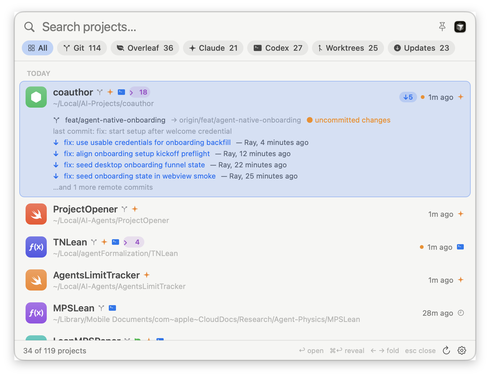

# ProjectOpener

A native macOS menu-bar launcher for your project folders. Press a global
hotkey, type a few characters, hit ↩ — the project opens in Cursor, VS Code,
your terminal, or wherever you want.

<p align="center">
  
</p>


## Features

- **Spotlight-style panel** — global hotkey (default ⌃⌥ Space, configurable) or
  the menu-bar icon. Pin it to keep it open while you work.
- **Intelligent discovery** — beyond scanning your project roots for git
  repositories, it learns from the tools you actually use:
  - **Claude Code** (`~/.claude/projects`): session dirs are decoded back to
    real paths (filesystem-guided — handles iCloud paths, spaces, dots), so
    projects you've worked on with Claude are found even outside the scan roots.
  - **Codex** (`~/.codex/sessions`): session `cwd`s map activity to projects.
  - **Cursor / VS Code** workspace storage: "last opened in your editor" counts
    as activity, and a plain ↩ opens each project in the editor you last used
    on it.
  - **Git worktrees** (`git worktree list`), including hidden ones under
    `.worktrees/` and agent-managed checkouts — grouped under their main repo
    with a fold-out pill.
- **Sorted by real activity** — last commit, newest Claude/Codex session,
  editor activity, or folder mtime, whichever is newest; sectioned into
  Today / Last 7 days / Last 30 days (older folded away by default).
- **Remote awareness** — background `git fetch` (never prompts for
  credentials), `↓N` behind-badges, and on the selected row: who did what on
  the remote (author · subject · when), unpushed counts, dirty state.
- **Categories** — filter chips for Git / Overleaf / Claude / Codex /
  Worktrees / Updates. Overleaf projects (git.overleaf.com remotes) get a
  one-click "open on Overleaf" button.
- **Smart icons** — project kind detected from marker files (Lean, LaTeX,
  Swift, Rust, Go, Node, Python, notebooks, docs, AI-agent repos) and rendered
  as colored glyph tiles; your custom Finder folder icons are respected.
- **Fast** — AppKit table UI, ~120 projects scanned in ~2 s in the background
  while the cached list shows instantly.

## Keys

| Key | Action |
| --- | --- |
| ⌃⌥ Space | toggle launcher (configurable) |
| ↑ / ↓ | move selection |
| ← / → | fold / unfold a worktree group (when not typing) |
| ↩ | open in last-used / default editor |
| ⌘↩ | reveal in Finder |
| esc | close |

## Install

Download the DMG from [Releases](../../releases), drag ProjectOpener to
Applications, launch it, and optionally enable "Launch at login" in Settings.

> **Gatekeeper note:** releases are not notarized (no Apple Developer ID).
> The first launch needs a right-click → Open, or
> `xattr -d com.apple.quarantine /Applications/ProjectOpener.app`.

Or build from source (macOS 14+, Xcode command line tools):

```bash
./build.sh                 # → dist/ProjectOpener.app
./make-dmg.sh              # → dist/ProjectOpener-<version>.dmg
swift build && .build/debug/ProjectOpener --scan   # CLI debug of discovery
```

## Privacy

Everything stays on your Mac. ProjectOpener reads local metadata only — your
configured scan roots, `~/.claude/projects` and `~/.codex/sessions` file
names/heads (to map sessions to folders), and Cursor/VS Code workspace
storage. The only network activity is `git fetch` on your own repositories,
and only if "Check remotes automatically" is enabled. Nothing is uploaded
anywhere; caches live in `~/Library/Caches/ProjectOpener/`.

## Settings

Right-click the menu-bar icon → Settings: scan roots, depth, excluded folder
names, default editor, terminal app, hotkey, auto-refresh interval, auto
fetch, smart editor choice, launch at login.

## License

MIT — see [LICENSE](LICENSE).
